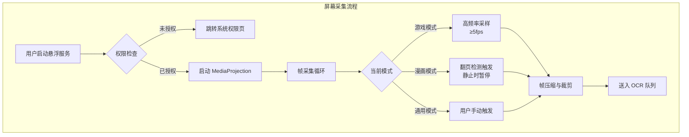
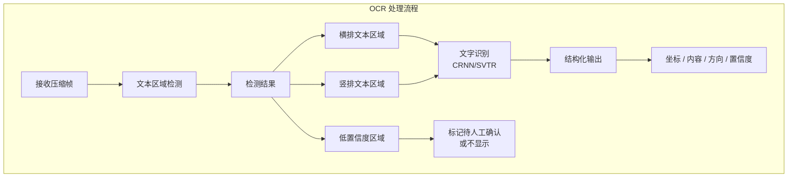
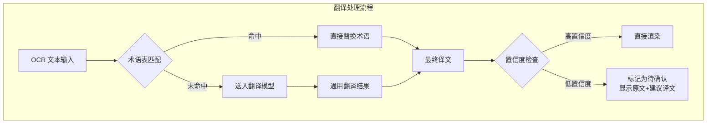
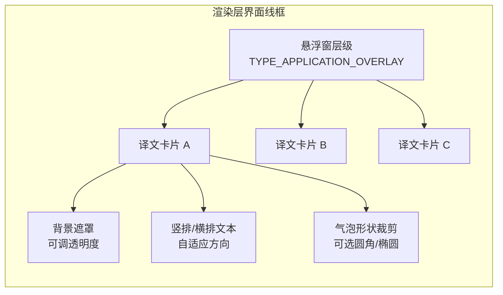
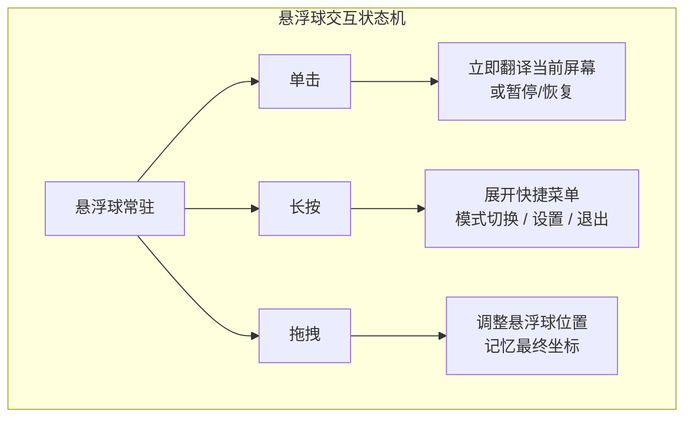
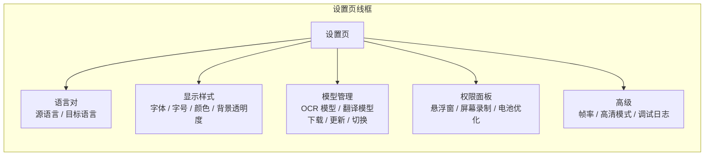

# 屏幕翻译器 Android App — 产品需求文档

> 版本：v1.0  
> 创建日期：2026-08-09  
> 状态：草案  
> 负责人：[待确认]

## 变更记录

| 版本 | 日期 | 变更内容 | 作者 |
|------|------|----------|------|
| v1.0 | 2026-08-09 | 初稿 | AI Assistant |

---

## 1. 需求背景

### 1.1 业务背景与触发源

日本游戏和漫画在中国拥有庞大的爱好者群体。大量未官方本地化的日文游戏（尤其是视觉小说、JRPG）和漫画作品无法被非日语用户顺畅消费。现有解决方案存在明显缺口：

- **传统翻译 App**（如 Google Translate）需要用户手动截图、切换应用、框选文字，流程冗长，破坏沉浸感
- **在线翻译工具**依赖网络连接，且存在隐私泄露风险（屏幕内容上传至云端）
- **现有屏幕翻译工具**多聚焦社交/网页场景，对游戏对话气泡、漫画竖排文本等特殊排版缺乏专门优化

触发源来自于核心用户群体在玩未汉化日文游戏或阅读生肉漫画时，反复经历"出戏式翻译"的痛点：每遇到一段日文就需要中断当前体验，进行截图、切换应用、OCR、翻译、回想的操作循环。

### 1.2 用户当前状态与痛点

| 痛点 | 当前替代方案 | 缺陷 |
|------|-------------|------|
| 游戏对话看不懂 | 查字典、截图翻译 | 流程长，错过剧情节奏 |
| 漫画竖排文字难识别 | 手动输入文字到翻译 App | 生僻字和手写体难以输入 |
| 担心隐私泄露 | 使用在线 OCR/翻译 API | 屏幕内容被上传至第三方服务器 |
| 网络不稳定时无法使用 | 提前查好词库 | 无法应对动态内容 |

### 1.3 不解决的后果

若不提供专门针对游戏和漫画场景的离线屏幕翻译工具，用户将持续面临以下问题：

- 大量优质日文内容消费门槛过高，导致潜在受众流失
- 现有在线方案在隐私敏感场景（如个人消息、账号界面）不可用
- 游戏体验被频繁打断，剧情沉浸感无法建立

> 证据强度标注：[Research-backed]（基于用户场景推断与竞品市场验证）/[Hypothesis]（具体用户规模数据待补充）

---

## 2. 目标

### 2.1 产品目标

在 3 个月内交付一款面向 Android 平台的离线屏幕翻译器，核心能力为：实时捕获屏幕内容，通过端侧 OCR 识别日文文本框，调用本地翻译模型将译文覆盖渲染在原位置之上，使游戏玩家和漫画读者无需切换应用即可读懂剧情。

### 2.2 可衡量的成功指标

| 指标类别 | 指标名称 | 基准值 | 目标值 | 观察周期 |
|----------|----------|--------|--------|----------|
| 质量指标 | 日文文本识别准确率（F1） | — | ≥85% | 持续 |
| 质量指标 | 翻译可用率（BLEU/人工评分） | — | ≥70% | 持续 |
| 体验指标 | 端到端延迟（截屏到译文显示） | — | ≤2s | 持续 |
| 体验指标 | 用户单次任务翻译步数 | 5+ 步（现有方案） | 1 步（触发即译） | MVP 发布后 |
| 业务指标 | MVP 期内测用户留存（7 日） | — | ≥30% | MVP 发布后 30 天 |

> 具体数值基线需在内测阶段校准。[To be confirmed]

---

## 3. 用户与场景

### 3.1 目标用户画像

| 画像 | 日语能力 | 使用频率 | 决策权 | 痛点严重程度 |
|------|----------|----------|--------|-------------|
| **核心玩家** | N5~N3（初学至中级） | 每周 5+ 次，每次 1~3 小时 | 自主决策 | 极高 |
| **漫画读者** | N5~N2 | 每周 3+ 次，每次 30~60 分钟 | 自主决策 | 高 |
| **硬核爱好者** | N2~N1（能读懂大意） | 每周 2+ 次 | 自主决策 | 中（查词为主） |

### 3.2 核心场景与优先级

| 优先级 | 场景 | 触发条件 | 用户目标 | 完成标准 |
|--------|------|----------|----------|----------|
| P0 | 游戏实时翻译 | 玩家遇到未汉化日文对话 | 在 2 秒内看到译文，不打断游戏节奏 | 译文覆盖在对话框上，无需手动框选 |
| P0 | 漫画实时翻译 | 读者翻到带日文的漫画页 | 看到翻译后的对话气泡 | 支持竖排文本，译文排版适配气泡 |
| P1 | 静态图片翻译 | 用户主动选择相册图片 | 获取图中日文翻译 | 支持批量处理和手动校对 |
| P2 | 术语收藏 | 用户遇到高频生词 | 保存并复习该词汇 | 支持自定义术语表影响翻译结果 |

### 3.3 使用前置条件

- 设备运行 Android 8.0（API 26）及以上
- 授予"在其他应用上层显示"（悬浮窗）权限
- 授予屏幕录制/采集权限（MediaProjection）
- 预留至少 500MB 存储空间用于模型文件

---

## 4. 竞品与市场调研

### 4.1 竞品分析

| 竞品 | 定位 | 目标用户 | 规模 | 亮点 | 局限 |
|------|------|----------|------|------|------|
| **Bubble Screen Translate** | 通用屏幕翻译工具 | 多语言普通用户 | 高（Pro 版付费） | 支持漫画/游戏专用模式、竖排文本、离线包 | 核心 OCR 与翻译依赖云端或受限离线包，隐私不透明 |
| **Screen Translate (Langslab)** | 实时屏幕悬浮翻译 | 社交媒体/游戏用户 | 1M+ 下载 | 悬浮球交互轻量，支持 146 种语言 | 离线能力有限，对竖排/复杂排版支持弱 |
| **overlay-translator (开源)** | 开源游戏/漫画翻译器 | 技术用户、隐私敏感者 | GitHub 500+ Stars | 支持 PaddleOCR、离线 LLM、TTS、无需 ROOT | 非商业产品，UI/UX 粗糙，模型配置门槛高 |
| **Google Translate** | 通用翻译平台 | 大众用户 | 数十亿级 | 相机模式、离线包、品牌信任 | 无法悬浮覆盖，需手动截图切换，无游戏/漫画排版适配 |

> 数据来源：APKQari、Free Apps Android、GitHub 公开信息，截至 2025~2026 年。[To be supplemented - 需定期更新]

### 4.2 竞品功能对比矩阵

| 维度 | Bubble Screen Translate | Screen Translate | overlay-translator | 本产品（目标） |
|------|------------------------|------------------|-------------------|---------------|
| 悬浮窗覆盖渲染 | 支持 | 支持 | 支持 | 支持 |
| 游戏对话气泡检测 | 支持（专用模式） | 基础支持 | 基础支持 | **强化支持** |
| 漫画竖排文本识别 | 支持 | 不支持 | 部分支持 | **强化支持** |
| 完全离线运行 | 部分（Pro 离线包） | 有限 | 支持 | **核心卖点** |
| 端侧 OCR（开源） | 未明确 | 未明确 | PaddleOCR | **PaddleOCR/EasyOCR** |
| 端侧翻译模型 | 未明确 | 未明确 | 离线 LLM / Bergamot | **专用日中翻译模型** |
| 拟声词过滤 | 不明确 | 不支持 | 不支持 | **漫画模式支持** |
| 术语表/自定义词典 | 不支持 | 不支持 | 不支持 | **P1 支持** |

### 4.3 研究结论

- **核心流程差距**：现有竞品在"自动检测文本框并精准覆盖"这一核心体验上参差不齐。开源方案功能完整但体验粗糙；商业方案体验较好但离线能力受限。
- **市场机会**：专门针对"游戏+漫画"双场景、以完全离线为核心卖点的屏幕翻译器在市场中存在明显空白。隐私敏感型用户和长期内容消费者对端侧方案有强烈需求。
- **差异化定位**：以端侧开源 OCR + 本地翻译模型为技术底座，以游戏/漫画专用场景适配为体验壁垒，服务追求隐私安全和长期低成本使用的核心受众。

### 4.4 MVP 范围与关键假设验证

MVP 必须打通的核心路径：

1. 用户启动悬浮服务 → 打开游戏/漫画 → 自动/手动触发翻译 → 屏幕出现覆盖译文
2. 支持横排和竖排日文的基础识别与翻译
3. 完全离线运行，无需网络连接

验证方法：

- 内测阶段收集 50+ 名种子用户的准确率反馈和延迟数据
- A/B 对比自动检测与手动框选在用户体验上的差异

---

## 5. 功能需求

### 5.1 功能总览表

| # | 模块 | 功能描述 |
|---|------|----------|
| 1 | **屏幕采集引擎** | 通过 Android MediaProjection API 获取屏幕帧数据，支持全屏和指定区域两种采集模式。具备帧率自适应机制：游戏场景保持高采样率（≥5fps），漫画场景在翻页时触发单次采集，静止时暂停以降低功耗。采集数据经压缩后送入 OCR 模块。 |
| 2 | **文本检测与识别（OCR）** | 基于端侧 OCR 模型检测屏幕中的文本区域并识别文字内容。支持横排日文、竖排日文、中英混合。游戏模式下优先检测对话气泡形状区域；漫画模式下过滤拟声词（オノマトペ）区域。输出结构化数据：文本框坐标（四边形）、文字内容、排版方向、置信度。 |
| 3 | **翻译引擎** | 基于端侧翻译模型将识别出的日文文本翻译为中文。支持通用翻译和上下文感知（多句联动）。提供术语表接口，允许用户自定义词汇映射以覆盖模型翻译结果。输出结构化数据：译文内容、替换建议、置信度。 |
| 4 | **覆盖渲染层** | 通过 Android 悬浮窗（TYPE_APPLICATION_OVERLAY）在屏幕目标位置绘制译文。支持原文隐藏（半透明遮罩）或原文保留（译文覆盖在上方）。支持竖排文本渲染、气泡形状裁剪、字体大小/颜色/背景透明度调整。具备抗锯齿和边缘柔化以避免遮挡画面细节。 |
| 5 | **场景适配** | 游戏模式：针对对话框形状优化检测 ROI，过滤 UI 元素（血条、菜单按钮），支持实时字幕式跟随。漫画模式：针对分镜区域优化检测，支持拟声词过滤，保持阅读顺序（从右至左、从上到下）。 |
| 6 | **交互控制** | 提供全局悬浮球作为触发入口，支持单击快速翻译、长按进入设置、拖拽调整位置。提供通知栏常驻控件，支持暂停/恢复服务、切换模式（游戏/漫画/通用）。 |
| 7 | **应用设置** | 语言对管理（默认日→中，可扩展）、显示样式设置（字体、字号、颜色、背景透明度、行高）、模型管理（OCR 模型/翻译模型下载、更新、切换）、权限状态面板。 |
| 8 | **权限与系统交互** | 引导用户授予悬浮窗权限和屏幕录制权限。检测电池优化白名单状态并提示加入，防止后台服务被系统杀死。适配 Android 各版本权限行为差异（API 26~35）。 |

### 5.2 模块详细设计

#### 模块 1：屏幕采集引擎

**原型图**

**功能描述**

- **业务逻辑**：服务启动后建立屏幕采集会话。游戏模式下以固定频率抓取屏幕帧，通过帧差异度检测判断是否处于静止画面，若画面变化率低于阈值则跳过处理。漫画模式依赖用户翻页动作触发，支持单次全屏翻译和自动跟随（每 3 秒检测一次画面变化）。通用模式仅响应用户手动触发。
- **交互逻辑**：用户在设置页开启"启动时自动运行" → 开机后悬浮球自动出现 → 用户进入目标应用 → 点击悬浮球或等待自动翻译。
- **规则约束**：单帧分辨率默认降级至 720p 以控制推理耗时，用户可在设置中选择"高清模式"（1080p）。最低支持设备屏幕密度为 320dpi。
- **边界与异常**：用户拒绝屏幕录制权限时，服务无法启动，提示"需要权限才能捕获屏幕内容"。采集会话因系统回收（内存不足）断开时，自动保存当前状态并在 5 秒后尝试重建，最多重试 3 次。

---

#### 模块 2：文本检测与识别（OCR）

**原型图**

**功能描述**

- **业务逻辑**：OCR 模块接收屏幕帧后，首先通过文本检测模型定位所有可能的文本区域。游戏模式下，在检测前加入 UI 元素过滤规则（基于位置模板：屏幕四角、底部居中为高频 UI 区）。漫画模式下，对面积过小或形状过于细长的区域进行拟声词过滤。识别完成后，将结果按阅读顺序排序（漫画：从右至左列优先；游戏：从上到下）。
- **交互逻辑**：OCR 完成后，若检测到有效文本，自动触发翻译并渲染。若置信度低于 0.7，则不自动显示译文，仅在悬浮球上显示红点提示，用户点击后可手动查看识别结果并选择是否显示。
- **规则约束**：单行文本最大长度 100 字符，超过则自动截断并标记。竖排文本的最小高度为 20px，低于此阈值不进入识别流程。
- **边界与异常**：OCR 模型未下载完成时，提示"模型加载中"并显示下载进度。识别结果全为空时，不渲染任何覆盖层，避免遮挡画面。模型推理超时（>3s）时，丢弃当前帧并记录超时日志。

---

#### 模块 3：翻译引擎

**原型图**

**功能描述**

- **业务逻辑**：翻译引擎接收 OCR 输出的文本列表，按术语表进行前置替换。随后将文本送入端侧翻译模型进行推理。支持短句（<20 字）和长句（20~100 字）分批处理。对于游戏对话中常见的省略主语、口语化表达，模型需具备上下文拼接能力：将当前句与前 1 句合并后翻译，提升代词和省略句的准确性。
- **交互逻辑**：翻译完成后，译文自动送至渲染层。用户在设置中开启"显示原文对照"时，译文下方同时显示缩小字号的原文。
- **规则约束**：单句最长支持 100 字符，超出则拆分为多句并行翻译。术语表最大支持 500 条自定义条目，优先级高于模型输出。
- **边界与异常**：翻译模型未加载时，显示"翻译模型加载中"。翻译结果为空或乱码时，降级显示原文并标记"翻译失败"。连续 3 次翻译失败时，提示用户检查模型完整性。

---

#### 模块 4：覆盖渲染层

**原型图**

**功能描述**

- **业务逻辑**：渲染层根据 OCR 输出的坐标信息，在对应屏幕位置创建覆盖视图。每个文本框对应一个译文卡片，卡片尺寸根据原文框自动计算，支持等比例缩放和最小边距（卡片边缘与屏幕边缘至少保持 8px）。游戏模式下卡片背景默认半透明黑色（透明度 60%），漫画模式下默认毛玻璃效果。竖排文本时，文字从上到下排列，每列从右至左。
- **交互逻辑**：用户双击译文卡片可进入编辑模式，支持手动修改译文并保存至术语表。长按卡片可拖动调整位置（仅在当前会话有效）。
- **规则约束**：单卡片最大宽度不超过屏幕宽度的 40%。竖排文本时，单列最大 12 字，超出自动换列。字体大小范围 12sp~24sp，默认 16sp。
- **边界与异常**：译文卡片重叠时，自动检测碰撞并向四周偏移（最小间距 4px）。目标位置被系统 UI（如状态栏、导航栏）遮挡时，自动向内收缩避让。渲染服务崩溃时，清除所有覆盖层并恢复原始屏幕视图。

---

#### 模块 5：场景适配

**功能描述**

- **游戏模式**
  - **业务逻辑**：开启后，OCR 优先识别屏幕下半部分和中部区域的文本（对话常见位置）。自动过滤固定位置的系统 UI（如顶部状态栏、底部虚拟按键、侧边菜单）。支持"对话跟随"：当检测到新的文本框出现且旧文本框消失时，自动清除旧译文并渲染新译文。
  - **交互逻辑**：用户在通知栏控件或悬浮球菜单中切换至"游戏模式"。进入游戏后，首次检测到文本时弹出提示"已检测到对话，点击可暂停翻译"。
  - **边界与异常**：游戏全屏渲染（如 OpenGL/Vulkan）时，MediaProjection 仍可获得帧数据，但某些游戏可能启用防录屏（FLAG_SECURE），此时采集帧为黑屏，需提示用户"该应用禁止屏幕采集，无法翻译"。

- **漫画模式**
  - **业务逻辑**：开启后，OCR 按从右至左、从上到下的阅读顺序对检测到的文本框排序。引入拟声词过滤规则：面积小于阈值且包含特定字符模式（如重复假名、カタカナ拟声词库）的区域不自动翻译。支持跨页检测（检测到页面边缘时，提示用户是否翻译下一页）。
  - **交互逻辑**：用户切换至"漫画模式"后，系统自动检测翻页动作（画面大幅变化）并触发新一轮翻译。用户可点击"重新识别"按钮清除当前覆盖层并重新处理。
  - **边界与异常**：漫画应用本身带有水印或阅读器 UI 时，OCR 可能误识别。用户可通过"圈选模式"手动框定翻译区域，覆盖自动检测结果。

---

#### 模块 6：交互控制

**原型图**

**功能描述**

- **业务逻辑**：悬浮球为全局单入口，常驻于屏幕上层。单击行为根据当前状态切换：若当前屏幕无译文，则触发翻译；若已有译文，则清除所有覆盖层。长按展开扇形菜单，提供模式切换（游戏/漫画/通用）、进入应用设置、完全退出服务三个选项。拖拽可调整位置，松手时自动贴边（左侧或右侧）。
- **交互逻辑**：用户首次启动应用时，引导教程以半透明高亮形式展示悬浮球的三种操作。悬浮球在非激活状态下半透明显示（透明度 50%），用户触碰时恢复不透明。
- **规则约束**：悬浮球直径 56dp，默认位置为屏幕右侧距底边 120dp。贴边时仅显示 1/3 球体在屏幕内，用户可点击边缘呼出。
- **边界与异常**：悬浮球位置与其他应用悬浮窗重叠时，响应点击优先级遵循 Android 系统层级（本应用悬浮窗使用 TYPE_APPLICATION_OVERLAY，不抢占系统级弹窗焦点）。用户误触悬浮球导致翻译时，提供 3 秒"撤销"浮层提示。

---

#### 模块 7：应用设置

**原型图**

**功能描述**

- **业务逻辑**：设置页分为语言、显示、模型、权限、高级五个区块。模型管理页展示当前已下载的模型版本、文件大小、上次更新时间，支持手动检查更新和删除本地模型以释放空间。权限面板实时显示各权限状态，未授权项提供一键跳转。
- **交互逻辑**：用户在设置页修改显示样式后，提供实时预览（使用内置示例图展示效果）。切换模型时，若新模型未下载，先进入下载流程（显示进度和预计剩余时间），下载完成后自动加载。
- **规则约束**：模型文件总大小上限 2GB，超出时提示用户清理旧版本。下载仅支持 Wi-Fi 环境下进行，使用蜂窝网络时需二次确认。
- **边界与异常**：模型下载中断时，支持断点续传。模型加载失败时，自动回退至上一版本并提示用户。存储空间不足时，禁止下载并引导用户清理空间。

---

#### 模块 8：权限与系统交互

**功能描述**

- **业务逻辑**：应用首次启动时，依次引导用户授予悬浮窗权限和屏幕录制权限。两个权限为 P0 功能的前置条件，缺一不可。引导流程采用分步式：每完成一步解锁下一步说明。检测到设备启用电池优化时，在设置页提示用户将本应用加入白名单，以保证后台服务存活。
- **交互逻辑**：用户拒绝权限时，弹出说明弹窗解释该权限的具体用途（如"屏幕录制权限仅用于捕获游戏画面进行本地 OCR，不会上传任何数据"），并提供"去设置"按钮。用户连续拒绝两次后，不再主动弹窗，改为在设置页显示红色警告条。
- **规则约束**：权限引导必须在用户完成首次启动的欢迎页之后触发，不得在应用启动瞬间直接请求。
- **边界与异常**：Android 12+（API 31+）的媒体投影权限需要用户在每次启动时确认，应用需在服务启动时捕获该 Intent 并妥善处理。设备厂商定制系统（如 MIUI、ColorOS）对悬浮窗和后台服务有特殊限制，需在帮助文档中提供针对性引导。

---

## 6. AI 精度与评估

> 本章节针对 OCR 和翻译两个 AI 模块定义评估标准。

### 6.1 准确率定义

| 质量维度 | 定义 | 目标阈值 |
|----------|------|----------|
| 文本检测召回率 | 画面中所有真实文本框中被正确检出的比例 | ≥90% |
| 文本识别准确率 | 检出文本框中字符完全正确的比例 | ≥85% |
| 翻译可读性 | 译文通顺、无语法错误，能传达原文意思 | ≥80%（人工评分） |
| 格式一致性 | 竖排/横排方向识别正确，文本框坐标偏差 < 5% | ≥95% |
| 响应稳定性 | 同一场景多次识别结果一致（无抖动） | 抖动率 < 5% |

### 6.2 评估体系

**离线评估**

- 构建测试集：包含 200 张游戏截图（视觉小说、JRPG）、200 张漫画页（少年漫、少女漫、青年漫）
- 标注标准：人工标注所有文本框坐标、文字内容、排版方向、是否拟声词
- 评分指标：Precision、Recall、F1（检测）；Accuracy、Edit Distance（识别）；BLEU、人工评分（翻译）
- 回归测试：每次模型迭代必须在测试集上跑通，指标下降即阻断发布

**人工评审**

- 评审员：3 名日语 N2 以上内部人员 + 5 名种子用户
- 评分维度：识别准确率、翻译准确度、排版美观度、整体可用性
- 一致性机制：分歧项由第 6 人仲裁
- 坏 case 归档：所有识别失败、翻译离谱的案例录入数据库，用于后续模型优化

**在线反馈**

- 行为指标：单用户日均翻译次数、翻译后停留时长、手动编辑率
- 质量反馈： thumbs up/down 按钮、问题标签（识别错/翻译错/排版乱/漏识别）
- 效率指标：端到端平均延迟、模型推理耗时

### 6.3 Go/No-Go 标准

| 检查项 | Go 标准 | No-Go 处理 |
|--------|---------|-----------|
| 准确率 Go | 测试集 F1 ≥ 80%，人工评分 ≥ 3.5/5 | 优化模型或扩充训练数据 |
| 体验 Go | 端到端延迟 P90 < 3s | 优化模型量化等级或降低分辨率 |
| 安全 Go | 用户数据零上传，网络请求仅用于模型更新 | 阻断所有非必要网络连接 |
| 成本 Go | 端侧推理单次耗电 < 5%（10 分钟连续使用） | 优化推理频率或模型大小 |

### 6.4 降级机制

- **低置信度**：OCR 置信度 < 0.7 的文本框不自动渲染，红点提示用户手动确认
- **翻译失败**：模型输出为空或乱码时，显示原文并提示"翻译失败"
- **性能不足**：设备内存 < 4GB 或 CPU 性能较弱时，自动切换至轻量版模型（牺牲部分准确率换取流畅度）
- **服务崩溃**：渲染服务崩溃时清除所有覆盖层，OCR 服务崩溃时 5 秒后自动重建

---

## 7. 数据与指标

### 7.1 核心指标

| 指标 | 定义 | 决策用途 |
|------|------|----------|
| 日活用户（DAU） | 每日启动悬浮服务的独立用户数 | 衡量产品粘性 |
| 单用户日均翻译次数 | 每个用户每天触发翻译的平均次数 | 衡量核心功能使用深度 |
| 7 日留存率 | 新用户在首次使用后的第 7 天仍返回的比例 | 衡量产品价值是否被认可 |

### 7.2 质量指标

| 指标 | 定义 | 目标 |
|------|------|------|
| OCR 检测 F1 | 文本框检测的综合 F1 分数 | ≥85% |
| 翻译人工评分 | 1~5 分制，3 分以上视为可用 | ≥3.5 |
| 端到端延迟 P90 | 从触发到译文显示的 90 分位延迟 | ≤2.5s |
| 覆盖层渲染崩溃率 | 渲染服务崩溃次数 / 总翻译次数 | <0.1% |

### 7.3 追踪需求

| 事件名 | 触发时机 | 属性字段 | 决策用途 |
|--------|----------|----------|----------|
| service_start | 用户启动悬浮服务 | 设备型号、Android 版本、启动方式 | 分析服务启动成功率与设备兼容性 |
| translate_trigger | 用户触发翻译 | 触发方式（自动/手动）、当前模式 | 分析用户习惯，优化默认行为 |
| ocr_complete | OCR 完成 | 识别字数、检测框数、平均置信度 | 监控 OCR 性能与准确率趋势 |
| translate_complete | 翻译完成 | 翻译字数、推理耗时 | 监控翻译性能 |
| render_show | 覆盖层显示 | 显示卡片数、用户是否编辑 | 分析翻译结果接受度 |
| user_edit | 用户手动编辑译文 | 编辑字数、是否保存术语 | 识别模型薄弱点，扩充术语表 |
| feedback_submit | 用户提交 thumbs up/down | 反馈标签、当前模式 | 指导模型优化优先级 |

> 所有追踪事件仅在本地聚合统计，不上传用户屏幕内容或原始 OCR 文本。定期生成匿名化报告供产品分析。[To be confirmed：是否接入第三方分析平台]

---

## 8. 依赖、风险与时间线

### 8.1 技术依赖

| 依赖项 | 说明 | 状态 |
|--------|------|------|
| 端侧 OCR 框架 | PaddleOCR/EasyOCR 的 Android 部署方案（ONNX Runtime / TFLite / NCNN） | [To be confirmed] |
| 端侧翻译框架 | 日中翻译模型的量化与 Android 推理（如 Helsinki-NLP/opus-mt-ja-zh 转 ONNX） | [To be confirmed] |
| Android MediaProjection | 系统级屏幕采集 API，无需 Root | 系统原生支持 |
| 悬浮窗系统 API | TYPE_APPLICATION_OVERLAY | 系统原生支持 |
| 模型分发与更新 | 模型文件下载、断点续传、版本管理 | 需自建或集成下载库 |

### 8.2 团队依赖

| 依赖方 | 职责 | 风险 |
|--------|------|------|
| 算法工程师 | OCR 模型选型、调优、Android 端部署 | 端侧模型体积与准确率难以兼顾 |
| Android 开发工程师 | 屏幕采集、悬浮窗渲染、系统权限适配 | 不同厂商系统行为差异大 |
| 产品经理 | 需求确认、测试用例评审、种子用户运营 | [Assumption — to be confirmed] |
| 测试工程师 | 多设备兼容性测试、模型效果评测 | 需覆盖低性能设备和各类游戏引擎 |
| 设计师 | 悬浮球/覆盖层交互设计、设置页 UI | 悬浮窗体验对细节敏感 |

### 8.3 外部依赖

| 依赖项 | 说明 | 缓解措施 |
|--------|------|----------|
| 开源模型许可 | PaddleOCR、翻译模型等开源协议（Apache 2.0 / MIT 等） | 法务审核，合规引用与署名 |
| Google Play 上架审核 | 悬浮窗和屏幕录制权限可能触发严格审核 | 提前准备权限说明视频和隐私政策 |
| 模型训练数据版权 | 若需自行微调模型，训练数据来源需合法 | 优先使用开源数据集或 CC0 数据 |

### 8.4 风险清单

| 风险 | 概率 | 影响 | 缓解策略 |
|------|------|------|----------|
| 端侧 OCR 准确率不达标 | 中 | 高 | 准备云端 OCR 降级方案作为兜底；建立测试集持续迭代模型 |
| 低端设备推理延迟过高 | 高 | 中 | 提供轻量版模型；支持用户手动调节帧率和分辨率 |
| 游戏/漫画应用启用防录屏 | 中 | 中 | 在产品说明中明确告知限制；探索辅助服务（AccessibilityService）等替代采集方案 |
| 用户隐私顾虑导致安装阻力 | 中 | 中 | 强化隐私说明（完全离线、数据不上传）；开源代码供审计 |
| 模型文件过大导致下载流失 | 中 | 中 | 模型分包下载（先下载基础包，按需下载扩展包）；支持 SD 卡存储 |
| 厂商系统杀后台 | 高 | 低 | 引导用户设置白名单；前台服务（Foreground Service）+ 通知栏常驻 |

### 8.5 里程碑

| 阶段 | 时间 | 交付物 | 验收标准 |
|------|------|--------|----------|
| 需求评审 | 第 1 周 | 定稿 PRD、技术方案评审 | 研发团队无歧义，可拆解任务 |
| 设计评审 | 第 2 周 | 交互原型、视觉稿 | 覆盖所有 P0 页面和状态 |
| 技术预研 | 第 2~3 周 | OCR/翻译模型 Android 端 Demo | 在目标设备上跑通端到端，延迟 < 5s |
| MVP 开发 | 第 3~8 周 | 可内测版本 | 支持游戏/漫画 P0 场景，完全离线 |
| 内测与迭代 | 第 8~10 周 | 修复版 + 模型优化 | 内测用户 7 日留存 ≥ 30%，P90 延迟 < 3s |
| 公测准备 | 第 10~12 周 | 应用商店素材、隐私政策、FAQ | 通过内部验收和合规审核 |
| 公开发布 | 第 12 周 | Google Play / 官网渠道上架 | — |

> 具体 staffing 和详细排期需根据团队规模进一步拆分。[To be confirmed]

---

## 9. 迭代计划

### 9.1 路线图

| 阶段 | 版本 | 核心目标 | 关键功能 |
|------|------|----------|----------|
| MVP | v0.1 | 验证核心假设 | 屏幕采集 + OCR + 翻译 + 覆盖渲染；游戏/漫画双模式基础支持；完全离线 |
| Beta | v0.5 | 体验打磨与模型优化 | 竖排文本优化；术语表；拟声词过滤；模型自动更新；多设备适配 |
| GA | v1.0 | 正式商业化 | 应用商店上架；用户反馈系统；崩溃监控；帮助文档完善 |
| Scale | v1.5 | 场景扩展 | 支持更多语言对（英→中、韩→中）；视频字幕实时翻译；社区术语库共享 |

### 9.2 MVP 必须关闭的核心路径

1. 用户安装应用 → 完成权限引导 → 启动悬浮服务 → 打开日文游戏/漫画 → 触发翻译 → 在 3 秒内看到覆盖在原文之上的中文译文
2. 用户在无网络环境下完成上述全部流程
3. 用户可进入设置调整翻译显示样式，修改即时生效

---

## 10. 验收标准

### 10.1 PRD 交付验收

| # | 检查项 | 通过标准 |
|---|--------|----------|
| 1 | 背景说明 | 明确回答了"为什么要做这款产品"，触发源清晰 |
| 2 | 目标可衡量 | 所有目标均附带量化指标和观察周期 |
| 3 | 用户定义 | 用户画像包含能力等级、使用频率、痛点严重程度 |
| 4 | 功能完整 | 功能总览表覆盖所有 P0/P1 模块，每个模块有业务逻辑、交互逻辑、规则约束、边界异常 |
| 5 | 原型清晰 | 每个核心模块配有 Mermaid 流程图或线框图 |
| 6 | AI 评估 | 定义了准确率指标、评估方法、go/no-go 标准和降级机制 |
| 7 | 风险可控 | 列出了技术、团队、外部依赖及缓解策略 |
| 8 | 时间线合理 | 里程碑明确，有验收标准和大概周期 |

### 10.2 产品功能验收（开发完成后）

| # | 检查项 | 通过标准 |
|---|--------|----------|
| 1 | 离线运行 | 关闭 Wi-Fi 和蜂窝数据后，完整翻译流程仍可执行 |
| 2 | 游戏场景 | 在 3 款以上不同引擎（Unity、Unreal、原生）的日文游戏中，对话文本可被识别并覆盖翻译 |
| 3 | 漫画场景 | 在 2 款以上漫画应用中，竖排文本可被正确识别并以竖排形式覆盖翻译 |
| 4 | 隐私安全 | 抓包验证应用运行时无屏幕内容、OCR 文本、翻译内容上传至外部服务器 |
| 5 | 性能基准 | 目标设备（中端安卓机，6GB 内存）上端到端延迟 P90 ≤ 3 秒 |
| 6 | 稳定性 | 连续使用 1 小时，渲染服务无崩溃，悬浮球响应正常 |

---

> 本文档中标注 `[To be confirmed]` 的内容需在后续评审中确认。标注 `[Assumption — to be confirmed]` 的内容为当前基于最佳判断的假设，需与相关方核实后固化。
