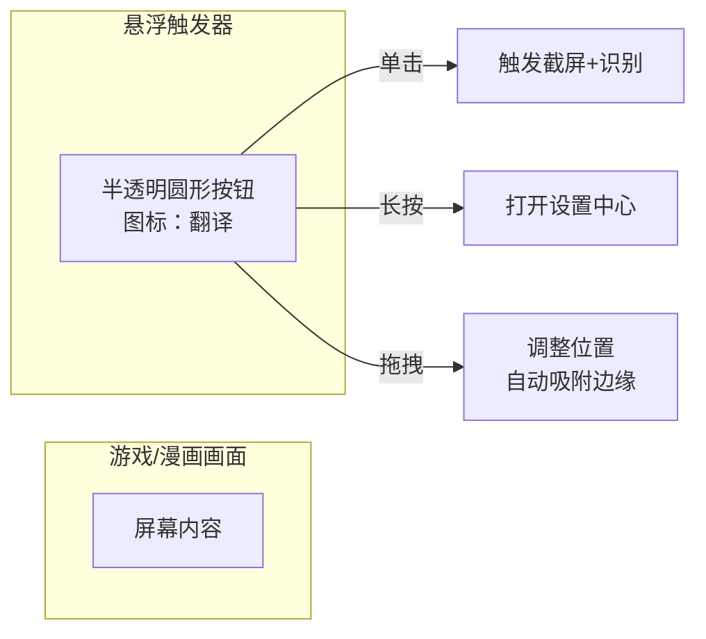
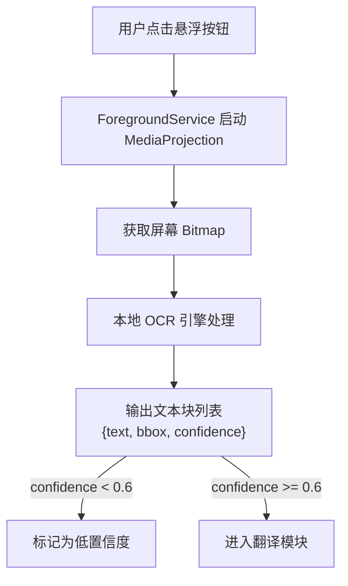
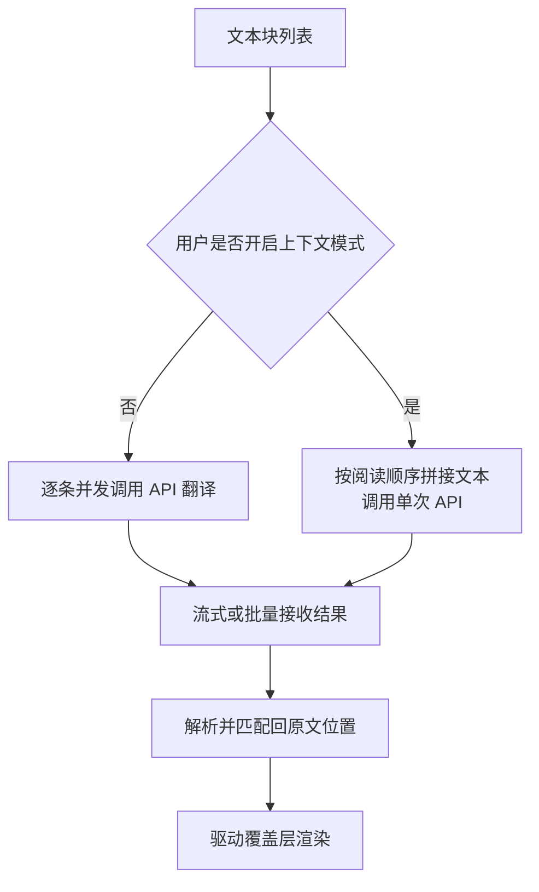
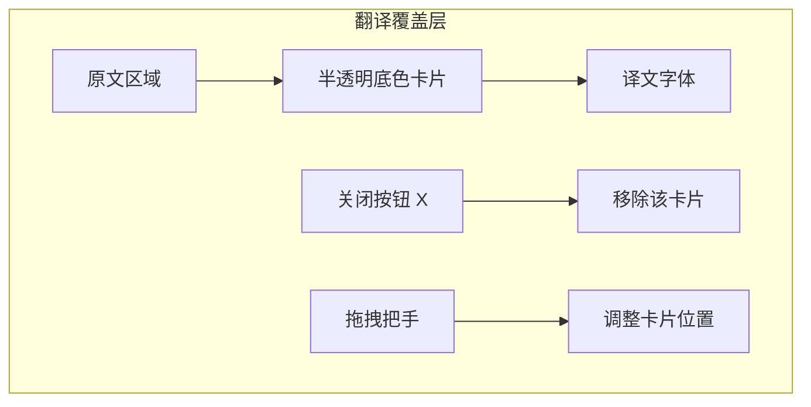
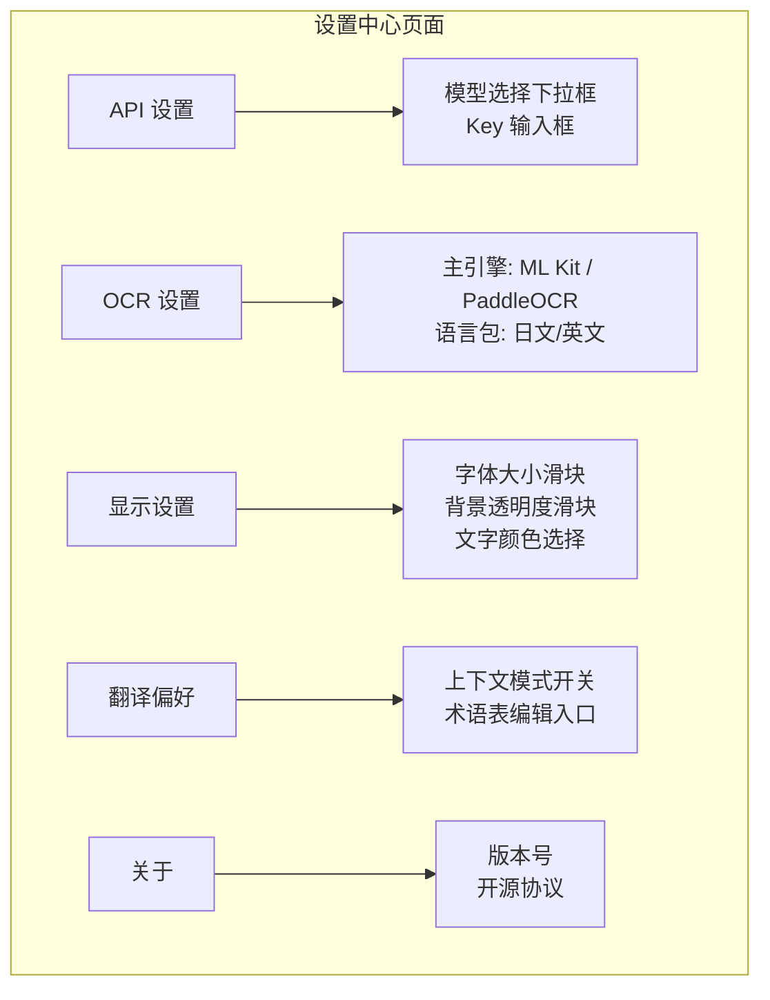
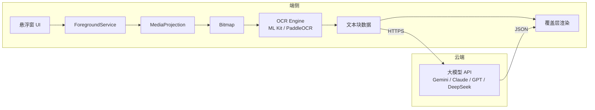

# 屏幕翻译器产品需求文档

> 版本：v1.0 | 日期：2026-08-07 | 状态：草案

---

## 1. 需求背景

### 1.1 触发源与痛点
大量中文用户在游玩未本地化的日系手游（如《FGO》《蔚蓝档案》）或阅读日文漫画时，因语言障碍无法顺畅理解剧情对话。现有解决方案（词典 App、截图后调用翻译软件）需要频繁切换应用，彻底打断了游戏和阅读的沉浸感。

### 1.2 不解决的后果
- 剧情驱动型游戏的玩家因看不懂对话而流失，只能等待缓慢的官方中文版或放弃作品。
- 漫画读者面对生肉（无翻译源）时阅读效率极低，体验碎片化，无法享受连贯阅读。

### 1.3 证据强度
[Research-backed] GitHub 与 XDA 社区中存在多个高 Star 的屏幕翻译开源项目（如 overlay-translator、EverTranslator），且 Google Play 已出现多款商业屏幕翻译应用，证明该需求真实存在且用户愿意为之付费或安装。

---

## 2. 产品目标

### 2.1 核心目标
让用户在无需离开当前应用的前提下，通过一次点击完成屏幕文本的识别与翻译，并将译文精准覆盖在原文所在位置。

### 2.2 成功指标
- 端到端延迟（点击悬浮按钮到首条译文覆盖）在 Wi-Fi 环境下 P90 ≤ 3 秒。
- 日文文本识别准确率针对游戏 UI 和漫画对话框达到 ≥ 85%。
- MVP 阶段用户 7 日留存率 ≥ 40%。

---

## 3. 用户与场景

### 3.1 目标用户画像

| 画像 | 核心特征 | 使用频率 | 痛点严重程度 |
|---|---|---|---|
| 日系手游玩家 | 18-30 岁，活跃于《FGO》《蔚蓝档案》《赛马娘》等未本地化日服 | 每天 1-3 小时 | 高，卡关或错过关键剧情会直接中断游戏体验 |
| 生肉漫画读者 | 20-35 岁，使用 Piccoma、COMIC FUZ 等日文漫画平台 | 每周 3-5 次 | 中高，阅读速度慢导致放弃长篇作品 |

### 3.2 核心场景

1. **游戏剧情翻译**：对话框弹出日文 → 玩家点击悬浮按钮 → 原文上方出现中文翻译，玩家继续点击推进剧情。
2. **漫画分镜翻译**：漫画页包含多组对话气泡 → 系统识别所有气泡 → 在每个气泡上方分别覆盖中文翻译。
3. **配置与设置**：首次启动引导开启必要权限，配置大模型 API Key，选择翻译偏好。

---

## 4. 竞品与市场研究

### 4.1 竞品分析

| 竞品 | 类型 | 目标用户 | 核心亮点 | 主要缺陷 |
|---|---|---|---|---|
| AI Screen Translator | 闭源商业应用 | 通用用户 | 支持 14+ 语言，悬浮覆盖，内置 AI 翻译 | 闭源不可定制，翻译质量受限于传统 NMT 引擎 |
| overlay-translator | 开源工具 | 技术用户 | 支持端侧/云端 OCR、离线 LLM、TTS、多翻译源 | 配置门槛极高，对普通用户不友好 |
| Screen Translator (XDA) | 商业应用 | 游戏玩家 | 离线 OCR，支持竖排日文，悬浮气泡交互 | UI 简陋，无上下文翻译能力，覆盖层无法自适应位置 |
| Screen Translator for Manga | 商业应用 | 漫画读者 | 提供 5 种 OCR 模型，支持竖排与横排文本框合并 | 依赖云端 OCR，隐私风险高，订阅费用贵 |

### 4.2 研究结论

- **大模型翻译是核心差异点**。现有竞品普遍使用传统 NMT（Google Translate、DeepL），而大模型（Claude、GPT、Gemini）在上下文理解、语气还原和术语一致性上明显优于传统方案，尤其在游戏剧情和漫画对话这种富含口语与角色性格的文本中优势更大。
- **开源方案验证了技术可行性**。overlay-translator 等项目的架构（悬浮窗 + MediaProjection + OCR）已在社区跑通，但产品化程度低，存在大量体验粗糙的环节（如覆盖层漂移、无自动清空）。
- **竖排日文与复杂排版是硬骨头**。漫画场景中的竖排文字、拟声词、艺术字是 OCR 的普遍短板，需要针对性的引擎策略和交互兜底（如允许用户手动修正位置）。

---

## 5. 功能需求

### 5.1 功能总览表

| # | 模块 | 功能描述 |
|---|---|---|
| 1 | 悬浮触发器 | 全局可拖拽悬浮按钮，单击触发单次翻译流程，长按打开设置中心。在屏幕边缘自动吸附，避免遮挡主要内容。 |
| 2 | 屏幕捕获与 OCR | 通过 MediaProjection 获取屏幕 Bitmap，由本地 OCR 引擎识别文本内容、区域坐标和置信度。支持横排与竖排文本检测。 |
| 3 | AI 翻译引擎 | 将识别到的文本发送至大模型 API，默认逐条独立翻译以降低延迟，可选场景上下文连贯翻译。支持用户自定义术语表和翻译风格。 |
| 4 | 覆盖层渲染 | 在原文字符区域上方绘制半透明翻译卡片，显示译文。支持拖拽调整位置、双指缩放字体、点击关闭单个卡片、一键清空所有覆盖。 |
| 5 | 设置中心 | 管理 API Key 与模型选择、OCR 引擎与语言包、覆盖层显示样式、术语表编辑、自动清空开关。 |

### 5.2 模块详细设计

#### 模块 1：悬浮触发器

**原型图**

**业务逻辑**
- 应用启动且权限已授予后，自动显示悬浮按钮。
- 按钮层级使用 `TYPE_APPLICATION_OVERLAY`，保证在游戏和视频上层可见。
- 屏幕边缘吸附规则：当按钮中心距某边缘小于 40dp 时，自动贴边并保留 1/3 露出，方便下次拖出。

**交互逻辑**
- 单击：发起一次完整的“截屏 → OCR → 翻译 → 覆盖”流程。
- 长按超过 500ms：打开设置中心 Activity。
- 拖拽：手指按下后移动超过 10dp 即进入拖拽模式，抬起后判断是否吸附。

**边界与异常**
- 权限未授予：首次显示引导页，解释为何需要悬浮窗权限，并提供跳转系统设置的按钮。
- 系统限制（小米、华为等）：检测到权限被系统拒绝时，显示品牌-specific 的开启教程图文。
- 游戏全屏或沉浸模式：悬浮窗在沉浸模式下仍然可见（依赖 SYSTEM_ALERT_WINDOW 的稳定性）。

#### 模块 2：屏幕捕获与 OCR

**原型图**

**业务逻辑**
- MediaProjection 必须通过用户授权的 Intent 启动，且运行在 ForegroundService 中（Android 10+ 强制要求）。
- OCR 引擎默认使用 Google ML Kit Text Recognition（端侧，免费，无需网络）。针对竖排日文或低置信度场景，允许用户在设置中切换至 PaddleOCR 引擎。
- 图像预处理：在送入 OCR 前，对 Bitmap 进行灰度化和高斯模糊去噪，提升识别率。
- 文本块过滤：过滤掉长度小于 2 的字符、纯数字、纯符号，减少无意义翻译调用。

**交互逻辑**
- 用户点击悬浮按钮 → 屏幕短暂闪过一个极淡的遮罩（200ms）提示已捕获 → 悬浮按钮变为加载动画。
- OCR 完成后，若未检测到文本，弹出 Toast "未检测到文本"。

**规则约束**
- 最小识别文本长度：2 个字符。
- 置信度阈值：0.6（可在设置中调整）。
- 单次最大处理文本块数量：50 块（防止漫画页面文字过多导致 API 超时或限流）。

**边界与异常**
- MediaProjection 授权被取消：下次触发时重新请求授权。
- 屏幕旋转中：延迟 500ms 再捕获，避免拿到形变画面。
- OCR 引擎初始化失败：回退到备用引擎；若均失败，提示"识别引擎加载失败"。
- 自窗口捕获：悬浮按钮本身可能被截入画面。通过裁剪 Bitmap 排除悬浮按钮区域（记录按钮实时坐标）。

#### 模块 3：AI 翻译引擎

**原型图**

**业务逻辑**
- 默认模式为逐条独立翻译。每个文本块作为独立请求并发发送（最多 5 并发），降低单点延迟，首条结果可立即渲染。
- 上下文模式（设置中可选）：将同屏文本块按坐标排序（漫画按从上到下、从右到左；游戏按对话框内阅读顺序）拼接为一段上下文，调用单次 API。该模式适用于剧情对话连贯性要求高的场景，但延迟较高。
- 术语表注入：若用户在设置中维护了术语表（如 "悠星=悠星网络", "まほう=魔法"），在调用 API 前将术语表注入 Prompt，要求模型优先使用指定译法。
- Prompt 工程：基础 Prompt 包含角色定义（"你是一名精通日文游戏和漫画的翻译"）、输出格式要求（"只输出译文，不添加解释"）、语气要求（"保持角色语气和口语感"）。

**交互逻辑**
- 翻译过程中，悬浮按钮显示旋转动画。
- 单条翻译完成即立刻渲染到屏幕，无需等待全部完成（渐进式显示）。
- 若某条请求失败，该文本框显示"翻译失败，点击重试"，点击后单独重发该请求。

**规则约束**
- API 超时：15 秒。超时后标记失败。
- 并发限制：最多 5 个并发请求（防止触发 API 限流）。
- Token 限制：上下文模式下，总 Token 不超过模型上限的 50%（如 Gemini 2.5 Flash 上下文窗口为 1M，但保守设置单次上限 4000 tokens）。
- 回退机制：主模型失败时，自动切换至备用模型（如 Gemini → DeepSeek）。

**边界与异常**
- API Key 无效或余额不足：返回 401/429 时，弹出通知引导用户检查 Key。
- 网络断开：检测网络状态，无网络时缓存识别结果，恢复后自动重试；或提示"网络异常，已保存至待翻译队列"。
- 内容安全拦截：模型返回空或拒绝翻译时，显示"[内容被过滤]"并记录日志。

#### 模块 4：覆盖层渲染

**原型图**

**业务逻辑**
- 每个文本块对应一个覆盖卡片，卡片的初始位置与 OCR 返回的 bounding box 对齐。
- 卡片背景默认为 80% 透明度黑色，文字为白色，保证在任意画面底色上可读。
- 卡片尺寸根据译文长度自动扩展，最大宽度不超过屏幕宽度的 60%，超出则换行。

**交互逻辑**
- 点击卡片外部区域（或点击悬浮按钮"清空"）：移除所有覆盖卡片。
- 长按单个卡片：进入编辑模式，可手动拖拽调整位置。
- 双指捏合：调整全局字体大小（实时生效）。
- 单击单个卡片：在卡片下方展开原文/译文对照（可选）。

**规则约束**
- 卡片不得超出屏幕边界。若计算位置超出，自动向内侧偏移。
- 多个卡片重叠时，点击事件只响应最上层的卡片（Z-order 按创建顺序）。
- 字体大小范围：12sp - 32sp。

**边界与异常**
- OCR 坐标偏移：允许用户通过拖拽手动修正位置。
- 原文被遮挡：若原文位于屏幕边缘，卡片优先向内侧展开。
- 游戏画面刷新（如对话框切换）：悬浮按钮提供"自动清空上一屏翻译"开关。若开启，在新一次翻译触发前自动清除旧卡片。

#### 模块 5：设置中心

**原型图**

**业务逻辑**
- API Key 本地加密存储（Android Keystore）。
- 模型选择影响 Prompt 和最大并发数。切换模型后，下次翻译生效。
- 术语表以键值对形式存储，支持导入/导出 JSON。

**交互逻辑**
- 进入设置时，悬浮按钮自动隐藏，返回后恢复。
- 输入 API Key 后，提供"验证"按钮，调用一次简单请求确认 Key 有效。

**规则约束**
- API Key：必填，最小长度 10 位。
- 术语表条目上限：500 条（MVP 阶段）。

**边界与异常**
- Keystore 不可用（罕见设备问题）：降级为 EncryptedSharedPreferences 存储，并在设置页提示安全风险。
- 术语表导入格式错误：提示"JSON 格式非法"，并保留原有数据。

---

## 6. 非功能需求与技术架构

### 6.1 性能要求
- 冷启动到悬浮按钮可用：≤ 2 秒。
- 截屏 + OCR 耗时：≤ 800ms（中端设备，如 Snapdragon 7 Gen 1）。
- 单条翻译 API 往返：≤ 1.5 秒（Wi-Fi，目标模型 Gemini 2.5 Flash）。
- 内存占用：前台服务运行时 ≤ 150MB。

### 6.2 技术架构图

### 6.3 关键技术决策

- **本地 OCR 首选 ML Kit**：Google 官方维护，端侧免费，跨 Android 设备一致性比 Tesseract 高 20-40%。PaddleOCR 作为高阶备选，用于攻克竖排日文和艺术字。
- **翻译默认 Gemini 2.5 Flash**：2025 年基准测试中 COMET 0.871，价格仅为 GPT-4.1 的约 1/20（$1.05/1M words），延迟 0.8s，日语表现位列顶级。Claude 3.5 Sonnet 和 GPT-4.1 作为高质量备选。
- **悬浮窗 + MediaProjection 组合**：AccessibilityService 无法读取游戏与漫画的自定义绘制内容，必须走屏幕捕获 + OCR 路线。前台服务承载两者生命周期。

---

## 7. 数据指标与追踪

### 7.1 核心指标

| 指标类型 | 指标名 | 定义 | MVP 目标 |
|---|---|---|---|
| 北极星指标 | 7 日留存率 | 首次使用后第 7 天仍打开应用的用户占比 | ≥ 40% |
| 过程指标 | 单次翻译成功率 | 点击翻译到至少一条结果覆盖完成的比率 | ≥ 90% |
| 质量指标 | 用户主动修正率 | 用户拖拽调整卡片位置或重试翻译的次数占比 | ≤ 15% |
| 效率指标 | 端到端延迟 P90 | 90% 请求的点击到首条覆盖完成时间 | ≤ 3.5s |

### 7.2 追踪事件

| 事件名 | 触发时机 | 用途 |
|---|---|---|
| translate_trigger | 用户点击悬浮按钮 | 衡量功能使用频率 |
| ocr_success | OCR 返回至少一条有效文本 | 监控识别成功率 |
| translate_chunk_success | 单条文本翻译成功并渲染 | 监控 API 稳定性 |
| overlay_moved | 用户拖拽覆盖卡片 | 识别 OCR 坐标偏移问题 |
| setting_engine_switched | 用户切换 OCR 或翻译引擎 | 指导默认引擎选择 |

---

## 8. 风险、依赖与合规

### 8.1 风险清单

| 风险 | 概率 | 影响 | 缓解策略 |
|---|---|---|---|
| 游戏反作弊系统误报 | 中 | 高 | PRD 明确仅使用标准 Android API（MediaProjection/SYSTEM_ALERT_WINDOW），不涉及内存修改或注入。在应用商店描述中声明此点。 |
| OCR 对复杂排版识别率低 | 高 | 中 | 双引擎策略（ML Kit + PaddleOCR）；提供用户手动框选区域功能（MVP 后迭代）。 |
| 大模型 API 成本失控 | 中 | 中 | 默认选用 cheapest 顶级模型（Gemini 2.5 Flash）；提供用量统计页；限制单用户并发。 |
| 悬浮窗权限被国产 ROM 限制 | 高 | 中 | 针对小米、华为、OPPO、vivo 提供专门的开权引导图文；在设置中提供"权限诊断"工具。 |
| 用户隐私顾虑 | 中 | 高 | 强调 OCR 在本地完成，仅文本（非图片）上传云端；隐私政策中明确数据处理方式。 |

### 8.2 外部依赖
- Google ML Kit 中文/日文语言包（随应用捆绑或动态下载）。
- 大模型 API 供应商的稳定性和定价策略。
- Google Play / 应用商店对悬浮窗类应用的审核政策。

### 8.3 合规
- 必须提供隐私政策，说明仅截取用户主动触发的屏幕内容，且图像在端侧处理。
- 遵守各 API 提供商的使用条款（如 OpenAI/Anthropic/Google 禁止特定类型内容翻译）。

---

## 9. 迭代路线图

### Phase 1：MVP（0-2 个月）
- 悬浮按钮 + MediaProjection 截屏。
- ML Kit OCR（日文横排优先）。
- Gemini 2.5 Flash 逐条翻译。
- 基础覆盖层渲染（固定样式）。
- 设置中心（API Key、模型选择）。

### Phase 2：体验优化（2-4 个月）
- PaddleOCR 引擎接入（针对漫画竖排）。
- 上下文连贯翻译模式。
- 术语表功能。
- 覆盖层样式自定义（字体、颜色、透明度）。
- 历史记录与收藏。

### Phase 3：规模化（4-6 个月）
- 多语言支持（韩文、英文游戏/漫画）。
- 自动翻译模式（定时截屏+翻译）。
- 社区术语表共享。
- 付费订阅（API 用量包、高级模型）。

---

## 10. 验收标准

### 10.1 功能验收
- [ ] 在《FGO》或《蔚蓝档案》日服中，点击悬浮按钮后 3 秒内，游戏对话框内出现中文覆盖翻译。
- [ ] 在 Piccoma 漫画页面中，能识别至少 80% 的可见对话气泡并给出翻译。
- [ ] 无网络时，应用不崩溃，并给出明确提示。
- [ ] 切换 OCR 引擎或翻译模型后，下次翻译立即生效。

### 10.2 性能验收
- [ ] 中端设备（如 Redmi Note 系列）端到端延迟 P90 ≤ 3.5 秒。
- [ ] 连续使用 1 小时，前台服务内存占用稳定在 150MB 以内。
- [ ] 应用后台运行 30 分钟，悬浮按钮仍可正常响应。

### 10.3 兼容性验收
- [ ] Android 10 / 12 / 14 系统上功能正常。
- [ ] 小米、华为、三星主流机型上悬浮窗权限可正常开启。
- [ ] 横屏游戏与竖屏漫画模式下，覆盖层位置计算正确。 